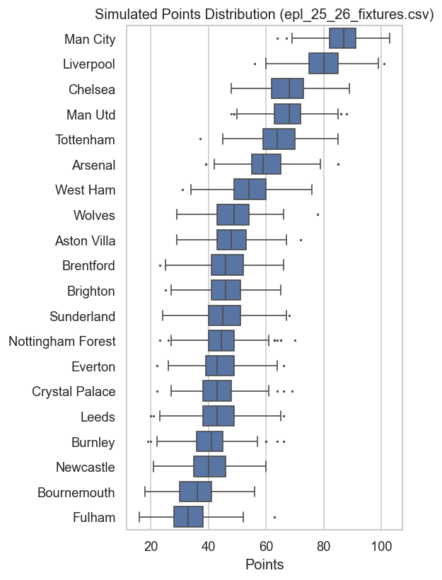
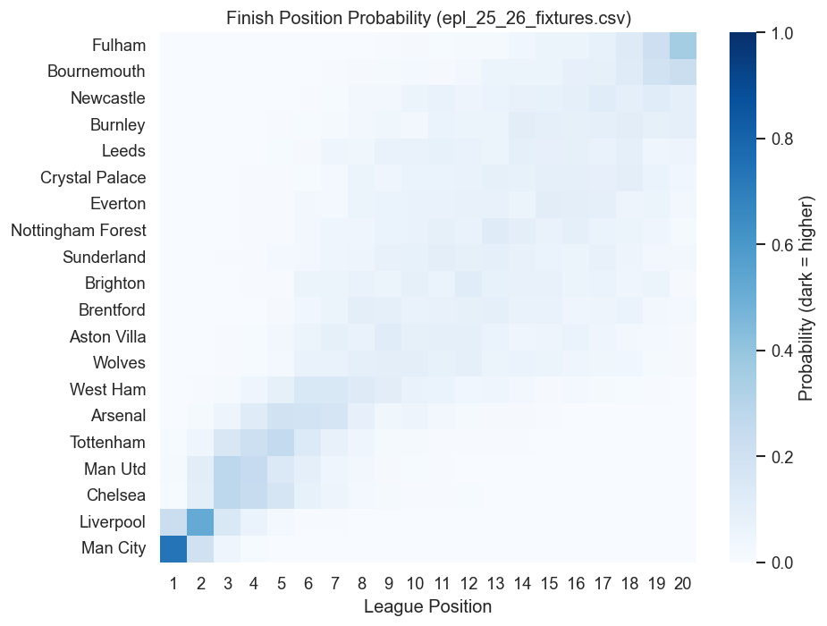
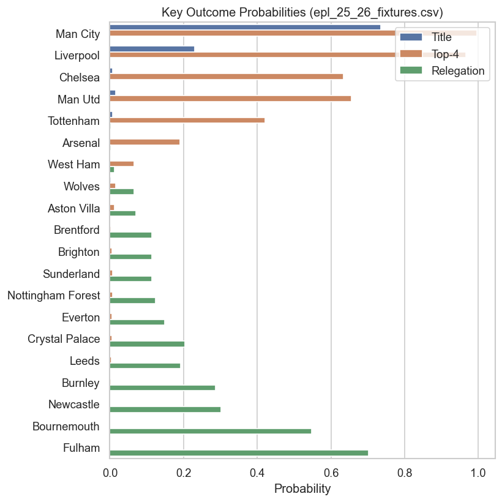

<div align="center">
  
  <h1>Monte Carlo Simulation of English Premier League — using Bivariate Poisson + Elo</h1>
</div>


Using a **Bivariate Poisson** (shared component) to model football matches and **Elo** as a covariate, a **Jupyter notebook** (`Final_Project.ipynb`) then performs **Monte Carlo simulations** to generate full-season distributions (points, positions, title/top-4/relegation probabilities). Includes lightweight backtesting.

---

## Table of Contents

1. [Overview](#overview)  
2. [Project Structure](#project-structure)  
3. [Installation](#installation)  
4. [Data](#data)  
5. [Quickstart](#quickstart)  
6. [What It Does](#what-it-does)  
7. [Outputs & Visualizations](#outputs--visualizations)  
8. [Configuration](#configuration)  
9. [Troubleshooting](#troubleshooting)  
10. [Roadmap / Future Work](#roadmap--future-work)  
11. [Citing & Background](#citing--background)  
12. [Contributing](#contributing)  
13. [License](#license)  
14. [Contact](#contact)

---

## Overview

- **Scoring model:** To capture goal dependence, using a bivariate Poisson with a common latent component $$\lambda_3$$.  
- **Team effects:** attack (α), defence (β), home advantage (η) with **ridge** regularization and sum-to-zero constraints on α and β.  
- **Elo with decay:** pre-match `HomeElo` / `AwayElo`; Elo ratio scales goal rates via exponent **γ**.  
- **Monte Carlo:** To simulate distributions over points, positions, and important outcomes, model entire seasons.
- **Backtests:** Utilizing historical fixtures and points data, compare the simulated mean points to the actual to obtain **MAE**.

---

## Project Structure

```plaintext
project-acm40690-monte-carlo-simulation-of-epl/
├── data/
│   ├── E0_19_20.csv
│   ├── E0_20_21.csv
│   ├── E0_21_22.csv
│   ├── epl_22_23_fixtures.csv
│   ├── epl_23_24_fixtures.csv
│   ├── epl_24_25_fixtures.csv
│   └── epl_25_26_fixtures.csv
├── points/
│   ├── epl_2022_23_points.csv
│   └── epl_2023_24_points.csv
├── images/
│   ├── heatmap.png
│   ├── points_boxplot_output.png
│   └── relegation_output.png
├── Final_Project.ipynb     # main notebook
├── README.md
└── LICENSE
```

---

## Installation

Use a clean environment (venv or conda).

```bash
# clone
git clone https://github.com/your-org/your-repo.git
cd your-repo

# create & activate venv
python -m venv .venv
# Windows:
.venv\Scripts\activate
# macOS/Linux:
# source .venv/bin/activate

python -m pip install --upgrade pip
pip install -r requirements.txt
```

**Example `Requirements.txt`:**
```txt
numpy>=1.24
scipy>=1.10
matplotlib>=3.7
pandas>=2.0
seaborn>=0.13
jupyter
```

---

## Data

We used football-data style match CSVs with:

- `Date` (DD/MM/YYYY or parseable), `HomeTeam`, `AwayTeam`, `FTHG` (home goals), `FTAG` (away goals)

Example:
```csv
Date,HomeTeam,AwayTeam,FTHG,FTAG
10/08/2019,Liverpool,Norwich,4,1
10/08/2019,West Ham,Man City,0,5
```

Backtest “actual points” files:

- Columns: `Team,Points` (the notebook renames `Points` -> `ActualPts` internally).
```csv
Team,Points
Manchester City,91
Arsenal,89
...
```

Backtest/forecast fixture files:

- Columns: `HomeTeam,AwayTeam` (no dates required for simulation).

>**Name consistency:** Verify that team names appear in *all* training, fixture, and point files.  Results will suffer from simple mismatches ("Man City" vs. "Manchester City").  To lessen these discrepancies, we made a few consistent manual adjustments to our CSV file.

---

## Quickstart

1. Open **`Final_Project.ipynb`** in Notebook/Jupyter Lab or VS Code.  
2. Execute all cells in order:
   - Load & clean data  
   - Compute Elo (with decay)  
   - Fit Bivariate Poisson model 
   - Backtest using fixtures & actual points (prints MAE)  
   - Simulate future seasons  
   - View plots inline

> The notebook saves or loads from the repository root; run it from the project folder.

---

## What It Does

- **Data engineering**
  - Parse dates, cast goals to `int`, sort chronologically.
  - Collect all unique teams from training + fixture files to ensure complete parameter vectors.

- **Elo (with decay)**
  - Baseline 1500 per team; update per match with
    - K-factor grid (e.g., 20/30/40), decay factor (e.g., 0.995).
  - Expected home result $E_h = \frac{1}{1+10^{(R_a - R_h)/400}}$; update both teams with a decayed step.

- **Model fit (Bivariate Poisson)**
  - For match $(h,a)$:
    - $$\lambda_1 = \exp(\alpha_h - \beta_a + \eta_h)\cdot\left(\frac{\mathrm{Elo}_h}{\mathrm{Elo}_a}\right)^{\gamma}$$
    - $$\lambda_2 = \exp(\alpha_a - \beta_h)\cdot\left(\frac{\mathrm{Elo}_h}{\mathrm{Elo}_a}\right)^{-\gamma}$$
    - $$\lambda_3 = \exp(\theta)$$ shared component
  - Penalized log-likelihood with ridge on $\alpha,\beta$, fitted via **BFGS** with zero-mean constraints on $\alpha$ and $\beta$.

- **Hyper-parameter search**
  - Small grid for speed: $K \in \{20,30,40\}$, $\gamma \in \{0.04,0.06\}$, $\lambda_{\text{ridge}} = 0.02$.
  - Backtests on two seasons; objective = average **MAE** between simulated mean points and actual points.

- **Monte Carlo**
  - Sample $k \sim \mathrm{Poisson}(\lambda_3)$, $x \sim \mathrm{Poisson}(\lambda_1)$, $y \sim \mathrm{Poisson}(\lambda_2)$; score $=(x+k,\; y+k)$.
  - Simulate each fixture list $N$ times; aggregate to points tables and rank distributions.

- **Reproducibility**
  - Simulation RNGs seeded: `_rng = np.random.default_rng(1)` for match sims; a separate `default_rng(0)` for tie-break jitter in ranking.

---

## Outputs & Visualizations

- The median simulated points for the current league cohort are shown in the **Predicted table** (printed).
- Each team's distribution of points is shown in a horizontal **boxplot**.
- **Heatmap of finish-position probability**
- The best teams are at the **top**; positions 1…N left→right; **darker** = higher likelihood.
- The bars showing the outcome probabilities are `P(Title)`, `P(Top-4)`, and `P(Relegation)`.


- The boxplot output of team points after simulation.

- Finishing probability of teams after simulation.

- The chances of team getting relegated/title/top 4.

---

## Configuration

Edit the first **Config** cell in `Final_Project.ipynb` (example below mirrors the notebook variables):

```python
from pathlib import Path

ROOT = Path(__file__).resolve().parent if "__file__" in globals() else Path.cwd().resolve()
DATA_DIR   = ROOT / "data"
POINTS_DIR = ROOT / "points"

training_csvs = [DATA_DIR / "E0_19_20.csv", DATA_DIR / "E0_20_21.csv", DATA_DIR / "E0_21_22.csv"]
backtest_fixtures_csvs   = [DATA_DIR / "epl_22_23_fixtures.csv", DATA_DIR / "epl_23_24_fixtures.csv"]
backtest_actual_pts_csvs = [POINTS_DIR / "epl_2022_23_points.csv", POINTS_DIR / "epl_2023_24_points.csv"]
future_fixtures_csvs     = [DATA_DIR / "epl_24_25_fixtures.csv", DATA_DIR / "epl_25_26_fixtures.csv"]

# Monte Carlo simulations per season
N_SIMS = 500
```

Model / search defaults (inside the notebook):

- Elo decay: `0.995` (effective step ≈ `(1 - decay) * K`)
- Search grids (for speed; expand for final tuning):
  - `K ∈ {20, 30, 40}`
  - `γ ∈ {0.04, 0.06}`
  - `λ_ridge = 0.02`

**Tips**
- Runtime scales roughly **linearly** with `N_SIMS`.
- Keep `N_SIMS` small while iterating; bump for final figures.

---

## Troubleshooting

- **Seaborn theming**  
  Use:
  ```python
  import seaborn as sns
  sns.set_theme(style="whitegrid", rc={"figure.dpi": 120})
  ```

- **Pandas `observed` warning**  
  For `pivot_table`, pass `observed=False` (already set), or switch to `.pivot()` if categories are fixed.

- **Plots not showing**  
  In some environments, add `%matplotlib inline` at the top of a notebook.

- **Paths / working directory**  
  The notebook uses project-relative paths via `pathlib.Path`. Run from the repo root (`cd your-repo`) or adjust `ROOT`.

- **Team name mismatches**  
  Make sure that training, fixtures, and points files use identical team names as strings.

---

## Roadmap / Future Work

- Dixon–Coles **time decay** in the likelihood (down-weight older matches).
- More covariates: injuries, transfers, schedule congestion (rest days).
- Bayesian / hierarchical variants for team effects and \( \lambda_3 \).
- Calibration checks (50/80/95% interval coverage) & reliability plots.
- Expanded hyper-parameter search and cross-league support.

---

## Citing & Background

- Dixon & Coles (1997). *Modelling Association Football Scores and Inefficiencies in the Football Betting Market*. **JRSS C** 46(2): 265–280. DOI: **10.2307/2986290**.  
- Related reading: https://royalsocietypublishing.org/doi/10.1098/rsos.210617

---

## Contributing

PRs welcome — loaders, metrics (rank corr, Brier), visual polish, or tuning refactors.

**Steps**
1. Fork.  
2. Create a branch.  
3. Commit changes with examples.
4. Open a Pull Request.

---

## License

Released under the **MIT License**. See [LICENSE](LICENSE).

---

## Contact

**Authors:** Anusha Sarla & Sanmesh Shintre  
**Emails:** anusha.sarla@ucdconnect.ie · sanmesh.shintre@ucdconnect.ie
